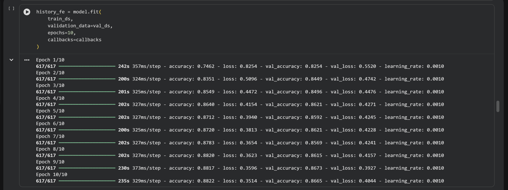
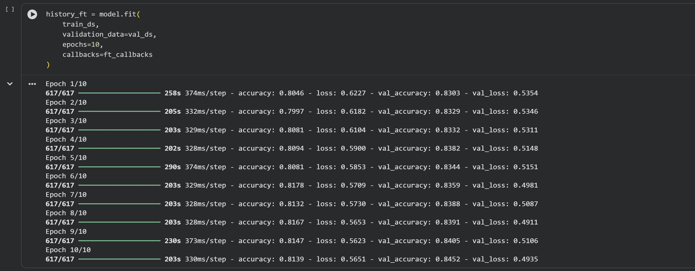

# Transfer Learning with EfficientNetB0 on Food-11 Dataset

## Overview
This project applies Transfer Learning using EfficientNetB0 on the Food-11 dataset using two different strategies:

1. Feature Extraction
2. Fine-Tuning

The experiments were conducted in **Google Colab with GPU acceleration**.

The goal of this project is to evaluate how retraining different parts of a pretrained network affects performance, convergence, and generalization.

---

# Dataset
The **Food-11 dataset** was used for multi-class food image classification.

The dataset contains images belonging to 11 food categories and was preloaded in the notebook environment.

---

# Preprocessing
The following preprocessing steps were applied:

- Images were resized to **224 × 224**
- EfficientNet preprocessing applied using `preprocess_input`
- Data augmentation techniques:
  - RandomFlip
  - RandomRotation
  - RandomZoom
- Labels converted from **class names to integer values**
- Dataset split into:
  - Training dataset
  - Validation dataset
  - Evaluation (test) dataset

These preprocessing steps help improve model generalization and training stability.

---

# Experiment 1: Feature Extraction

**Model Version:** EfficientNetB0 - Feature Extraction

In this experiment, the EfficientNetB0 base model pretrained on **ImageNet** was used as a fixed feature extractor.

### Configuration
- Base model: EfficientNetB0 (ImageNet pretrained)
- All base layers **frozen**
- Only the **classification head trained**
- Optimizer: Adam
- Learning rate: **1e-3**
- Loss: sparse categorical crossentropy

### Results
- Validation Accuracy: **86.88%**
- Test Accuracy: **88.26%**

Feature extraction achieved strong performance and converged quickly.

---

# Experiment 2: Fine-Tuning

**Model Version:** EfficientNetB0 - Fine-Tuning

Fine-tuning allows part of the pretrained model to update during training so that deeper features adapt to the new dataset.

### Configuration
- Base model: EfficientNetB0
- Last layers were **unfrozen**
- Lower learning rate used to prevent large weight updates
- Optimizer: Adam
- Learning rate: **1e-6**
- Loss: sparse categorical crossentropy

### Results
- Validation Accuracy: **84.49%**
- Test Accuracy: **85.75%**

---

# Fine-Tuning Experiments

During fine-tuning, multiple configurations were tested to explore the impact of unfreezing different numbers of layers.

Two configurations were tried:

- Unfreezing the last **20 layers**
- Unfreezing the last **10 layers**

Unfreezing too many layers slightly reduced training stability and did not improve validation accuracy significantly.

Reducing the number of trainable layers produced **more stable training and slightly better generalization**.

This observation suggests that **partial fine-tuning can be more effective than retraining too many layers when adapting pretrained models to smaller datasets**.

---

# Comparison

Feature extraction performed slightly better than fine-tuning in this project.

| Method | Validation Accuracy | Test Accuracy |
|------|------|------|
Feature Extraction | **86.88%** | **88.26%** |
Fine-Tuning | 84.49% | 85.75% |

### Key Observations
- Feature extraction converged faster
- Pretrained EfficientNet features were already highly effective
- Fine-tuning increased model flexibility but did not improve final accuracy in this dataset

---

# Observations

- Feature extraction converged faster and produced the best performance
- Fine-tuning remained stable but did not outperform the frozen-base approach
- Feature extraction showed slightly better **generalization**
- No severe **overfitting** was observed during training

---

# Conclusion

EfficientNetB0 achieved strong classification performance on the Food-11 dataset.

In this project, **Feature Extraction provided the best overall results**, while Fine-Tuning allowed deeper adaptation but did not significantly improve the final accuracy.

Future improvements may include:
- Gradual layer unfreezing
- Hyperparameter tuning
- Longer fine-tuning schedules
- Larger datasets

---

# Experiment Tracking (Bonus)

MLflow was used to track experiment results for both Feature Extraction and Fine-Tuning models.

The logged metrics include:

- Feature Extraction Validation Accuracy
- Feature Extraction Test Accuracy
- Fine-Tuning Validation Accuracy
- Fine-Tuning Test Accuracy

Using MLflow allows experiments to be tracked and compared systematically, improving reproducibility and experiment management.

---

# Training Metrics

## Feature Extraction Training

The EfficientNetB0 model was first trained using the **Feature Extraction approach**, where all base model layers were frozen and only the classification head was trained.

The training logs below show the progression of training and validation accuracy and loss across epochs.

---

## Fine-Tuning Training

In the second experiment, the last layers of the EfficientNetB0 model were unfrozen and retrained to adapt deeper features to the Food-11 dataset.

The training logs below show the progression of training and validation accuracy and loss during fine-tuning.

